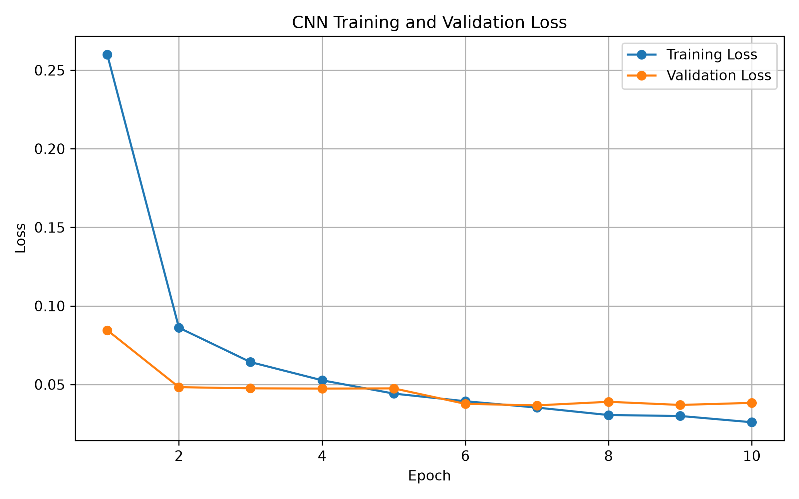
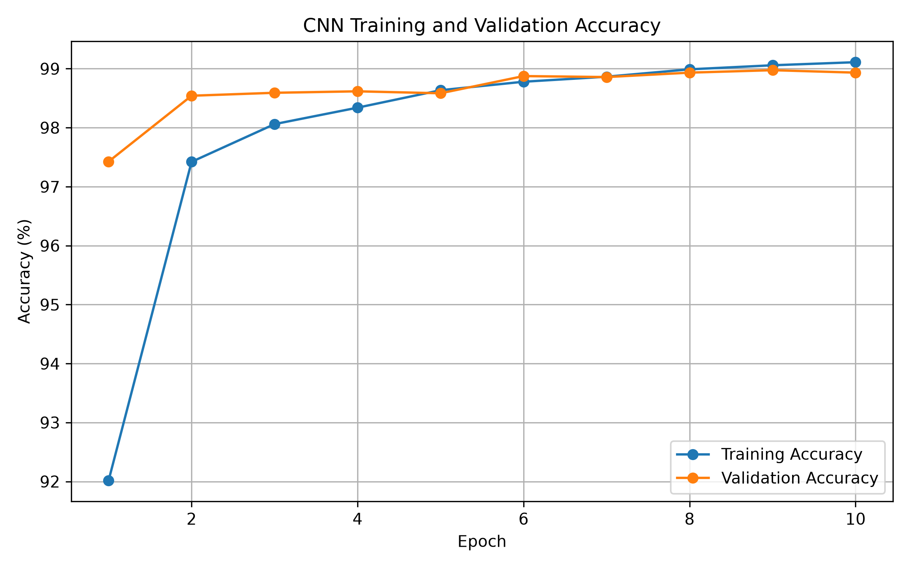
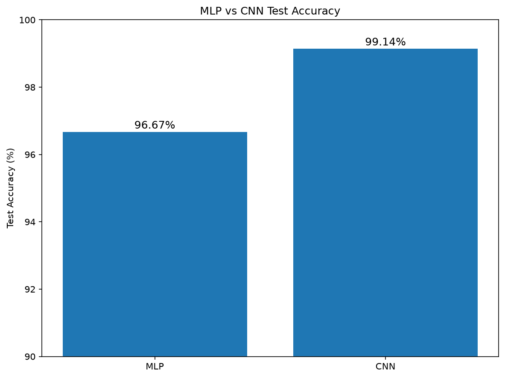
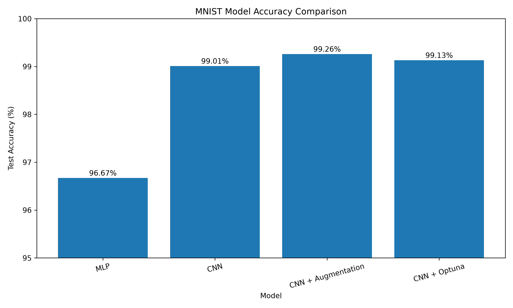
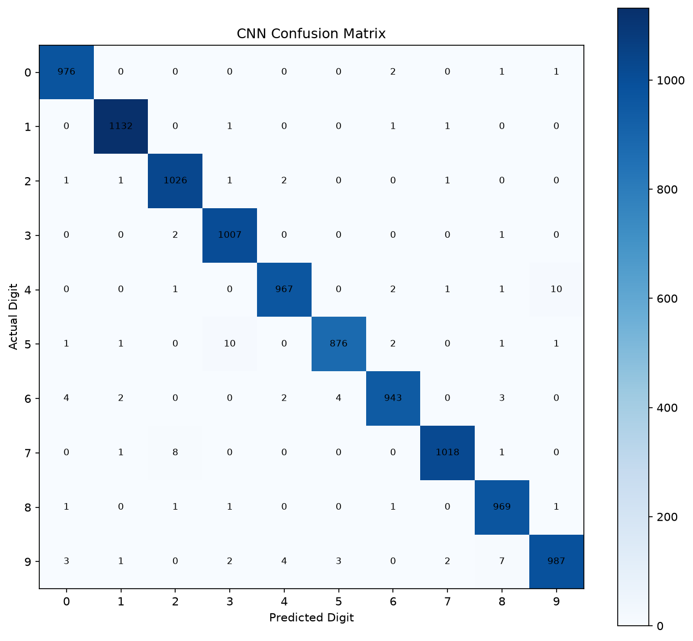
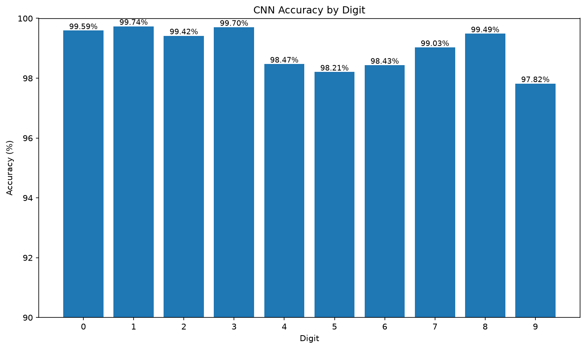
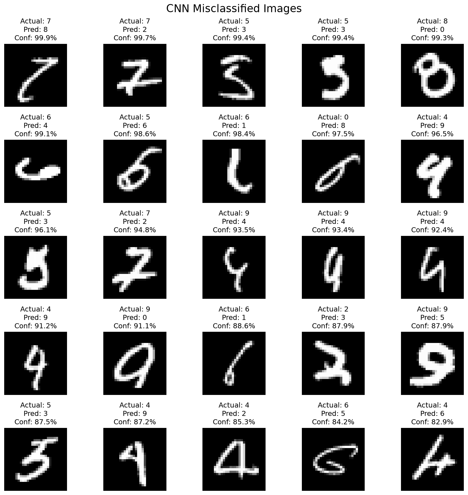
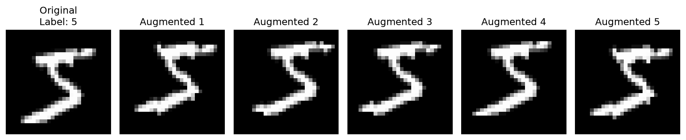
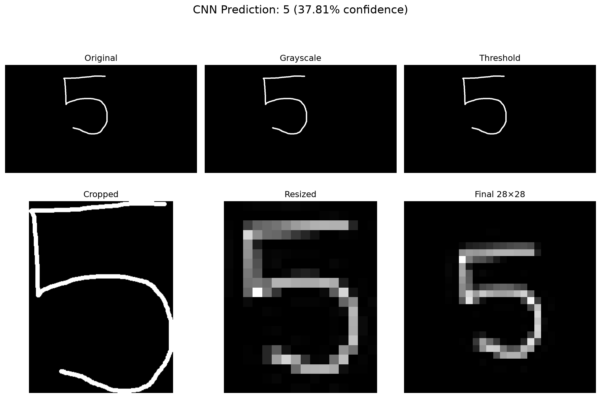
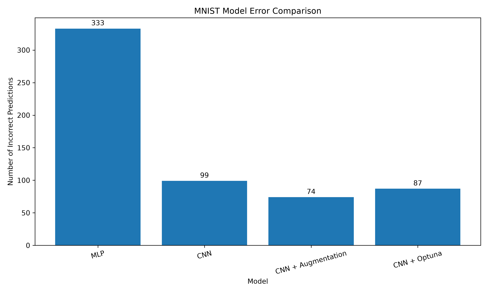

# MNIST Handwritten Digit Classification using PyTorch


A complete deep learning project for handwritten digit classification using PyTorch and the MNIST dataset.

The project progresses from a simple Multi-Layer Perceptron (MLP) to Convolutional Neural Networks (CNNs), data augmentation, hyperparameter optimization with Optuna, error analysis, model comparison, and a Streamlit web application.

---

## Project Overview

This project was built as an end-to-end deep learning pipeline.

The main goal is to classify handwritten digits from 0 to 9 using neural networks.

The project includes:

- MNIST dataset exploration
- MLP baseline model
- CNN model
- CNN evaluation
- Custom image prediction
- CNN error analysis
- Data augmentation
- CNN + augmentation
- Optuna hyperparameter optimization
- Model comparison
- Streamlit deployment
- Git/GitHub version control

---

## Model Comparison

| Model | Test Accuracy |
|---|---:|
| MLP | 96.80% |
| CNN | 99.14% |
| CNN + Data Augmentation | **99.26%** |

The CNN significantly outperformed the MLP because convolutional layers can learn spatial patterns in handwritten digits.

Data augmentation provided an additional improvement by exposing the model to modified versions of training images, improving generalization.

---

## Technologies Used

- Python
- PyTorch
- Torchvision
- NumPy
- Pandas
- Scikit-learn
- Matplotlib
- Seaborn
- Optuna
- Streamlit
- Pillow
- Git & GitHub

---
## Project Structure

```text
MNIST-PyTorch/
│
├── app.py
├── README.md
├── requirements.txt
│
├── data/
│
├── models/
│   ├── best_mnist_mlp.pth
│   ├── best_mnist_cnn.pth
│   ├── best_mnist_cnn_augmented.pth
│   ├── best_mnist_cnn_optuna.pth
│   └── best_mnist_cnn_v2.pth
│
├── results/
│   ├── augmentation_examples.png
│   ├── cnn_accuracy_curve.png
│   ├── cnn_class_accuracy.png
│   ├── cnn_confusion_matrix.png
│   ├── cnn_error_analysis.txt
│   ├── cnn_loss_curve.png
│   ├── cnn_misclassified_images.png
│   ├── final_model_accuracy.png
│   ├── final_model_comparison.txt
│   ├── final_model_errors.png
│   ├── mlp_vs_cnn_accuracy.png
│   ├── mlp_vs_cnn_error.png
│   ├── mlp_vs_cnn_loss.png
│   ├── preprocessing_4.png
│   ├── preprocessing_5.png
│   ├── processed_4.png
│   ├── processed_5.png
│   ├── processed_digit.png
│   └── processed_digit_centered.png
│
└── src/
    ├── dataset.py
    ├── model.py
    ├── cnn_model.py
    ├── train.py
    ├── train_cnn.py
    ├── train_cnn_augmented.py
    ├── evaluate.py
    ├── evaluate_cnn.py
    ├── evaluate_cnn_augmented.py
    ├── predict.py
    ├── predict_cnn.py
    ├── error_analysis.py
    ├── compare_all_models.py
    ├── visualize_augmentation.py
    ├── visualize_custom.py
    ├── visualize_prediction.py
    └── ...

    
---

## Results

### CNN Training Curves

#### Loss



#### Accuracy



---

### Model Comparison



The CNN significantly outperformed the MLP baseline.

---

### Final Model Comparison



The CNN with data augmentation achieved the best overall test accuracy of **99.26%**.

---

### Confusion Matrix



The confusion matrix shows that the CNN correctly classified the vast majority of MNIST test samples across all ten digit classes.

---

### Class-wise Performance



The model achieved consistently high accuracy across the ten digit classes.

---

### Error Analysis



The misclassified examples help identify the types of handwritten digits that are most difficult for the model.

---

### Data Augmentation



Data augmentation generates modified training examples to improve the model's ability to generalize to variations in handwritten digits.

---

### Custom Image Preprocessing

The custom image prediction pipeline performs several preprocessing steps before passing an image to the CNN.



The processed image is cropped, centered, resized to **28×28**, and converted into a tensor compatible with the trained CNN.

---

### Final Model Errors



The final model produced a very small number of incorrect predictions compared with the total number of MNIST test samples.

---

## Streamlit Application

The project includes a Streamlit web application that allows users to upload handwritten digit images and obtain predictions from the trained CNN model.

The application performs:

1. Image upload
2. Image preprocessing
3. Cropping and centering
4. Resizing to 28×28 pixels
5. Conversion to a PyTorch tensor
6. CNN inference
7. Predicted digit display
8. Class probability visualization

### Live Demo

🚀 **Try the application:**

[MNIST Digit Classifier](https://mnist-pytorch-uk5c3bebqzjbsskkkfgrh9.streamlit.app/)

---

## Installation

### 1. Clone the repository

```bash
git clone https://github.com/arnavkalia25/MNIST-PyTorch.git
cd MNIST-PyTorch


## Usage

### Train the MLP

```powershell
python src/train.py


---
---

## Machine Learning Concepts Covered

This project demonstrates:

- Neural networks
- Forward propagation
- Backpropagation
- Gradient descent
- Loss functions
- Optimizers
- Epochs and batches
- Training and validation
- CNN architecture
- Convolution
- Pooling
- Dropout
- Data augmentation
- Model evaluation
- Confusion matrices
- Precision, recall and F1-score
- Hyperparameter optimization
- Optuna
- Model checkpointing
- Custom image inference

---

## Optuna Hyperparameter Optimization

Optuna was used to search for better CNN hyperparameters.

The optimization explored parameters including:

- Learning rate
- Dropout
- Batch size
- Optimizer

The best configuration found during optimization achieved:

**Validation Accuracy: 98.42%**

Best hyperparameters:

```text
Learning Rate: 0.0010676307787900413
Dropout: 0.25452660518957637
Batch Size: 64
Optimizer: Adam

## Final Results

The best-performing model was:

**CNN + Data Augmentation**

### Test Performance

- Test Accuracy: **99.26%**
- Test samples: **10,000**
- Correct predictions: approximately **9,926**
- Incorrect predictions: approximately **74**

The augmented CNN performed better than both the baseline MLP and the standard CNN.

---

## Project Pipeline

```text
MNIST Dataset
      |
      v
Data Exploration
      |
      v
MLP Baseline
      |
      v
CNN
      |
      v
CNN Evaluation
      |
      v
Custom Image Prediction
      |
      v
Error Analysis
      |
      v
Data Augmentation
      |
      v
CNN + Augmentation
      |
      v
Optuna Hyperparameter Optimization
      |
      v
Model Comparison
      |
      v
Streamlit Application
      |
      v
GitHub / Deployment

## Conclusion

This project demonstrates a complete deep learning workflow for image classification using PyTorch.

Starting with an MLP baseline, the project progressed to CNN-based classification, data augmentation, error analysis, hyperparameter optimization, and deployment through Streamlit.

The final CNN with data augmentation achieved **99.26% test accuracy**, demonstrating the effectiveness of convolutional architectures and augmentation for handwritten digit recognition.

---

## Author

**Arnav Kalia**

GitHub: [arnavkalia25](https://github.com/arnavkalia25)